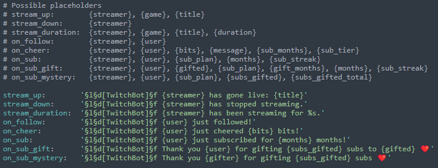
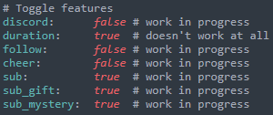

# TwitchBot

TwitchBot - awesome plugin for Minecraft

<h2>Features</h2>

<ol>
  <li>CUSTOM MESSAGES! 
    </li>
  <li>AWESOME FUNCTIONALITY! 
    </li>
  <li>GREAT OPTIMIZATION! 
    </li>
  <li>STABLE PERFORMANCE 
    </li>
</ol>

<h2>Commands</h2>

<ol>
  <li>/tbreload - Reloads configs (maybe)</li>
  <li>/tbupdate - Downloads some god-forgotten version of the plugin last updated in ~2021</li>
  <li>/tbwebhook - Sends a test message to discord webhook</li>
</ol>

<h2>Demo</h2>

 This work is licensed under a <a rel="license" href="http://creativecommons.org/licenses/by-nc-sa/4.0/">Creative Commons Attribution-NonCommercial-ShareAlike 4.0 International License</a>. 
