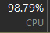
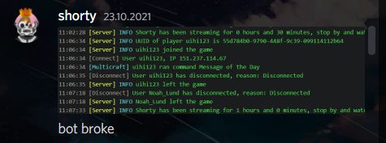

# TwitchBot

TwitchBot - ебейший плагин для майнкрафта

<h2>Features</h2>

<ol>
  <li>КАСТОМНЫЕ СООБЩЕНИЯ! 
    </li>
  <li>ЕБЕЙШИЙ ФУНКЦИОНАЛ! 
    </li>
  <li>ОТЗЫВЧИВЫЙ ДЕВЕЛОПЕР ВСЕГДА ПОМОЖЕТ! 
    </li>
  <li>ПРЕКРАСНАЯ ОПТИМИЗАЦИЯ! 
    </li>
  <li>СТАБИЛЬНАЯ РОБОТА 
    </li>
</ol>

<h2>Commands</h2>

<ol>
  <li>/tbreload - Перезагружает конфиги (наверное)</li>
  <li>/tbupdate - качает какую-то богом забытую версию плагина, которая последний раз обновлялась в ~2021</li>
  <li>/tbwebhook - Отправляет тестовое сообщение на вебхук</li>
</ol>

<h2>Demo</h2>

 This work is licensed under a <a rel="license" href="http://creativecommons.org/licenses/by-nc-sa/4.0/">Creative Commons Attribution-NonCommercial-ShareAlike 4.0 International License</a>. 
